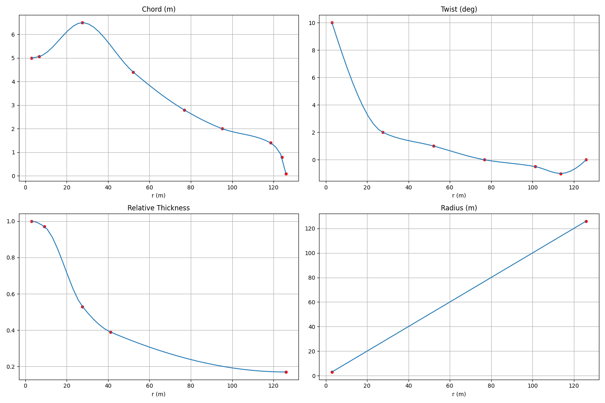
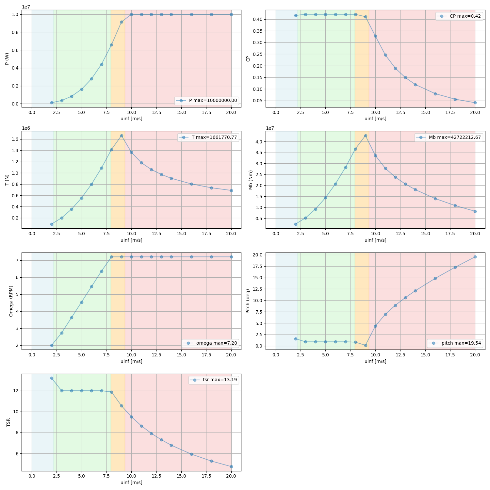
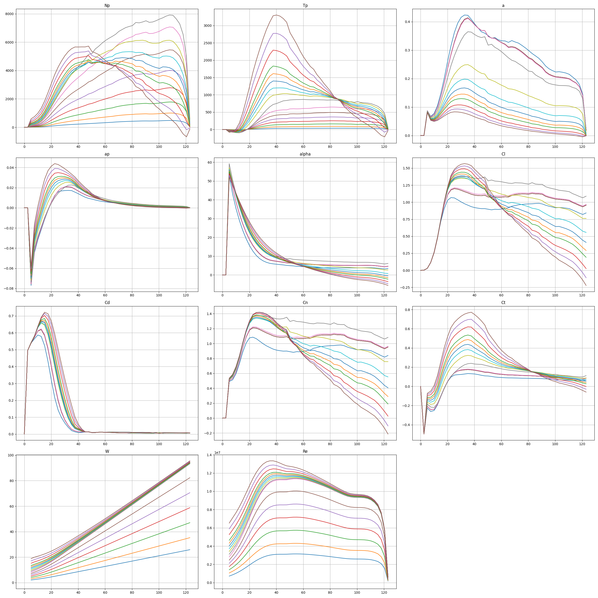
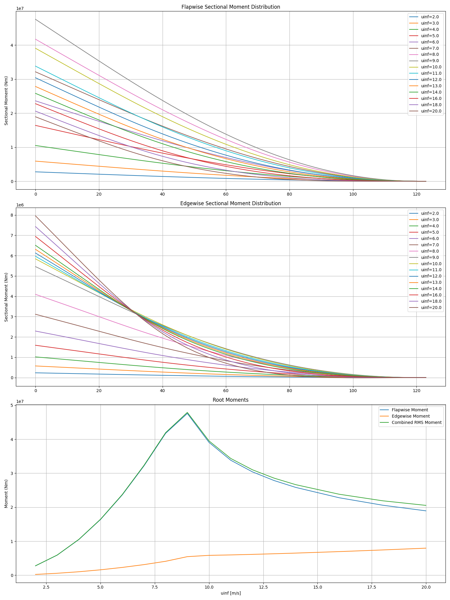

# B3 BEM

A wrapper around CCBlade for Blade Element Momentum (BEM) analysis of wind turbine rotors.
Optimizes turbine control in 4 regimes (min speed, opt speed, max speed, max power). 
Supports multiple run types: optimal control optimization and fixed setpoints.

## Installation

```bash
pip install -e .
```

## Usage

### CLI

```bash
b3-bem run --yml config.yml [--force] [--plot]
```

### Programmatic

```python
from b3_bem.core.step import B3BemStep
step = B3BemStep('config.yml', force=True)
step.run()
```

Outputs: CSV tables and PNG plots in the workdir.

## Configuration

The YAML config supports a `runs` section in `bem` to specify different analysis types:

```yaml
bem:
  runs:
    opt: {type: optimal}
    fixed: {type: fixed_setpoints, setpoints: [{wind_speed: 7, rpm: 7, pitch: 0}, {wind_speed: 12, rpm: 7, pitch: 3}]}
```

- `optimal`: Optimizes control for rated power across wind speeds.
- `fixed_setpoints`: Evaluates at specified fixed operating points.

## Example Output

### Planform


### Rotor Performance


### Blade Loads


### Moments


## License
MIT
